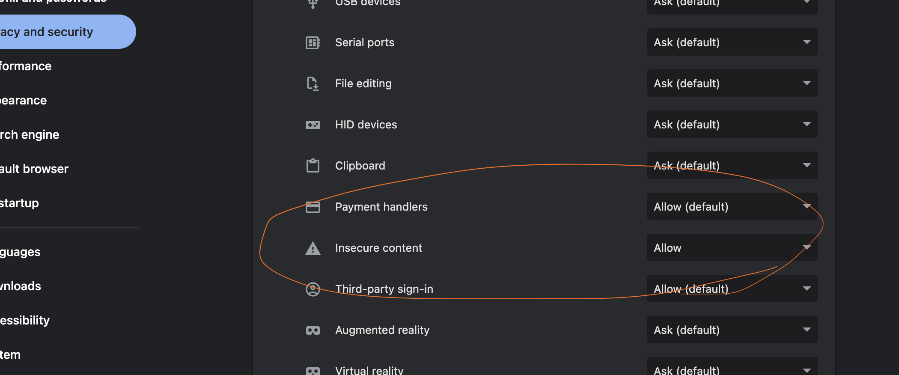

# Status
A tool to check the status of a OL network. This is used as a test tool to
easily and quickly verify changes within the network.

Hosted Here
[https://0lnetworkcommunity.github.io/status/](https://0lnetworkcommunity.github.io/status/)

Hack: For now you need to allow "mixed content" for that site:



## To Deploy
```
yarn
yarn build
yarn deploy

```

## To Dev
```
yarn
yarn dev

```

## API Views

### System
- transaction fees

#### block info
- epoch length
- block height

#### Governance

### Validators
#### All Validators
- eligible validators

#### balance info
- wallet balances

#### vouch
- validator vouches
- validator valid vouches

#### jail
- validator is in jail
- validator jail reputataion
- validator jail buddies


### Nice to have
- Infra Escrow balance